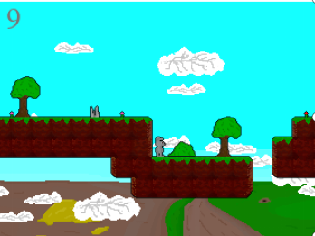
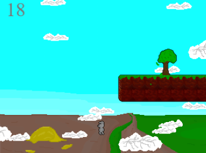

# Rabbit Hole



This project was my university thesis. **Rabbit Hole** is a simple 2D platformer game made in Python using the Pygame framework. The `linear_QNet` version includes a reinforcement learning agent that learns to play the game autonomously.



The game features a main character and several platform-style levels, similar to Super Mario. These levels can be completed by avoiding various dangers and obstacles. In the AI version of the project, the agent learns from its mistakes and gradually improves with each training iteration.

## Modules to Install

- [pygame](https://pypi.org/project/pygame/)
- [torch](https://pypi.org/project/torch/)
- [numpy](https://pypi.org/project/numpy/)

## Starting the Game

There is currently no executable file to launch the game automatically, as I didn't have time to create one back then.

However, you can start each version manually:

- To play the **platformer game** (human-controlled), run:  
  ```bash
  python game.py
  
- To run the **AI agent-based version**, execute:
  ```bash
  python agent.py
